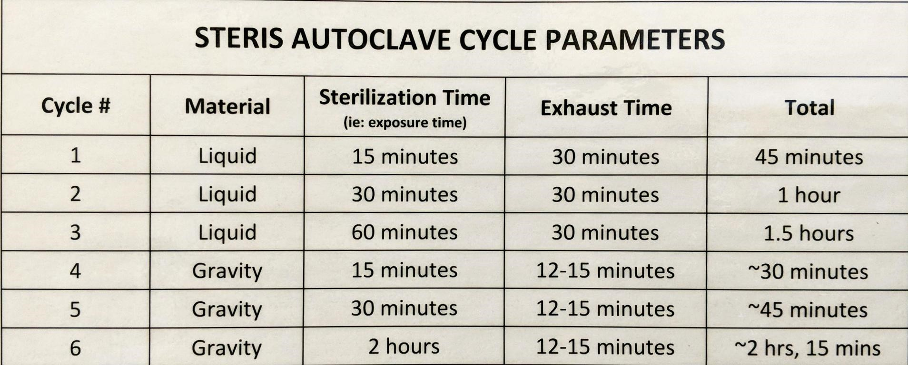

# Autoclave protocol

**Writing/Editing Credit**: Mark Mandel lab, Tiffany Lowe-Power

*Note, this needs to be updated with site-specific information* ~~this~~ indicates information that needs to be updated/verified. 

1. Before autoclaving, make sure:
   * Everything being autoclaved has autoclave tape on it (the tape indicates if items have been properly sterilized).
   * Any screw-on lids are loosely screwed onto any bottles going into the autoclave (if screwed down all the way, bottles could explode during the autoclaving process).
2. Load items to autoclave into autoclave bin.
   * Liquid and dry items are autoclaved seperately.
   * 4 L of liquids max
   * Don't stack liquids, but you can stack dry items.
3. Place the autoclave bin into the autoclave.
   * Biohazard bags shouldn't be touching the sides of the autoclave. Biohazard bags should be loosely tied so that steam can escape. 
4. Shut autoclave door and fully secure.
   * 106 Robbins autoclave doesn't seal perfectly unless you babysit it. You must hold the door up after starting the cycle until the cycle started & the door seals (~1 min). This is also the case for the Steris autoclave on the 2nd floor of Hutchison hall. The Castle autoclave has the ability for users to change the temperature. PLEASE MAKE SURE THE TEMPERATURE IS NOT CHANGES FROM 121 DEGREES CELCIUS.
5. Select the proper protocol from the menu.
   
   * Liquid =< 2 L = **Cycle 1**
   * Liquid =< 4 L = **Cycle 2**
   * Dry items (e.g. tips, tubes, empty glass flasks) = **Cycle 4**
   * Autoclave trash = **Cycle 5**
6. Press "Start" to start cycle.
7. ~~When cycle is finished, autoclave will ring~~
8. If autoclaving liquids, take items out of autoclave
   * Wear protective *dry* gloves and be careful--items will be very hot. 
   Be especially careful around the lids of liquid media where steam (>100C) can escape and cause steam burns *through autoclave gloves*.  Don't hold bottles around this area.
   * If autoclaving media with agar for pouring plates same-day, immediately put media in 50-60°C water bath. (Close cap completely to decrease contamination incidence)
   * For other liquids (including bottles of solid media to be re-melted later), leave out at room temperature. Put on the bench to cool.  When cooled, screw on the cap completely & put on the shelf. 
9. If autoclaving dry items, transfer to 50 C drying oven to dry (typically overnight). Or to the lab bench. 
10. If autoclaving liquids, immediately rinse out the autoclave bin with hot water to clean out any boil-over
11. If autoclaving biohazardous waste:
   * Label bag in sharpie with Lab name (TLP date ... ? <-- we need to figure this out)
   * If there is a lot of boil over, place autoclaved bag into another biohazard bag, dump the boiled over liquid into the bag as well, tie the bag closed for disposal
   * Once the trash is cooled, bring it to the du,,,,,,,,,,,,,,,,,,
   * ~~Make sure the big black trashcan isn't too full; if it's full, take the bag out, tie it closed, label with an "OK to trash" sticker, and set the bag to the side of the trashcan~~
