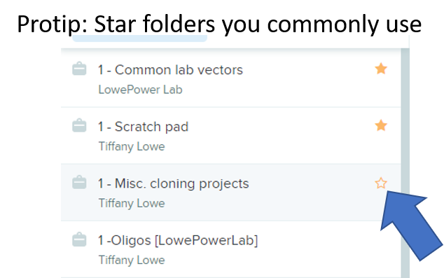

# Working in the Lab’s Benchling folder

## Admin vs. Member status

**New lab members** should make accounts at Benchling.com and ask a lab member to add them to our Benchling Organization “LowePower Lab”. Ask on the #onboarding Slack channel.  
* **Admin status** should be reserved for full-time gene jockeys. (i.e. postdocs / grad students who trust themselves not to mess up shared lab folders)
* **Member status** – all undergrads should be members (Rare exceptions may be granted). Visiting scientists or anyone without a strong genetics background should be a member. 
* Lab Admin Account.  I created a generic admin-level account with the email address lowepowerlab@gmail.com.  I can share the password to this account if necessary. 

## Core folders:

Core folders have the “1-“ prefix and are owned by the LowePower Lab admin account.  These folders should be used by everyone. 
* `1 – Common lab vectors`: This has common multi-purpose plasmids that the lab uses.  These should be organized into folders that provide information on their use cases, e.g. Ralstonia KOs, Ralstonia complementation, inducible expression, etc. 
* `1-Oligos`:  All primers should be uploaded from your personal excel sheets to this folder. This will allow you to “append” any primer sequences to plasmids or genomic regions that you are working with. 
* `1-Scratchpad`:  Sometimes we just want to play around with DNA sequences & we’re not sure it if it will lead to anything.  Create folders for these in the Scratchpad folder.  Then move into a full Project folder if the project lifts off. **It is possible to bulk move files in Benchling but not very intuitive**. This tutorial page will help: https://help.benchling.com/en/articles/1315560-move-or-copy-files
* `1-Misc. Cloning Projects`: A location to store cloning projects that aren't large enough to require their own project folder... yet.

## Project Folders

Generally, try to be organized. For example, if we were a lab that researches the T3SS, we might have a project with the following organization:

* `T3SS 2019` -- Project level. Add the year the project started (helps us keep track...)
* `T3SS genomic regions` sub folder that contains genomic regions exported from NCBI’s ‘graphic view’ of a DNA region as a Genbank flat file, uploaded to Benchling & tidied (named something like “GMI_ripAB_region_WT”
* `T3e overexpression` sub folder for plasmids that can overexpress a T3e.
* `T3e KOs` sub folder for plasmids that can make knockout mutants of T3es. 
* etc. 

What to do with old projects: Feel free to Archive any project that fizzles before it starts.  If any project has strains (E. coli or Ralstonia) that end up in the strain list, don’t archive them.  When they are complete or stalled indefinitely, add a “z-“ to the beginning of the name so it’s alphabetically at the bottom. 😊  For example, if we realize we could never make a dent in the T3SS Ralstonia world, we could rename that Project "z-T3SS"

