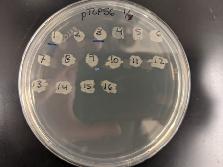
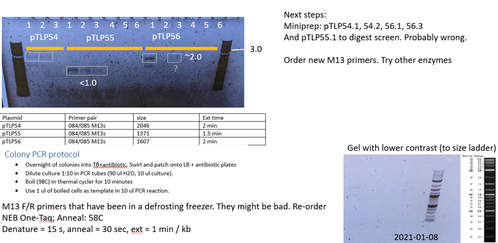

# Colony PCR

**Writing/editing credits:** Tiffany Lowe-Power
Updated 20210118

## General Tips

* Make a mastermix.
* Use a cheaper Taq-based PCR mix. 
* Less is more. 
Bacterial cells and EPS can interfer with PCR. 
If you add enough cells so that it's cloudy... that's >106 cells. 
PCR doesn't need that much DNA template.
* Colony PCR works better from liquid cultures than from colonies from plates. 
This protocol can likely be optimized further. 

## Colony PCR for *E. coli*

This “protocol” is an outline that you should amend with manufacturer’s instructions and internet searches.

### Step 1: Patch E. coli and create liquid overnights 

1. Label a patch plate (LB+antibiotics) like the photo below.  You will screen multiple "clones" of your construct.  We refer to these as "pTLP54.1", "pTLP54.2", ...  Date the plate. Initials are optional (if not included in the plasmid name)

1. Prep LB+antiobiotic in a 48-well deep plates with baffles (autoclavable and reusable).  In your notebook, record the planned location where you will put each colony (use a plate layout excel template). Use the AliQ pipette handler to repeatedly dispense the broth. 
1. Using 1 sterile toothpick per colony, pick a silnge well-isolated colony.  Patch it over a number on the patch plate. Then swirl the toothpick in the broth and discard. 
1. Incubate the 48-deep well plate at 37C with shaking overnight.  Incubate the patch plate at 37C stationary overnight. 

### Step 2: Colony PCR
Set up the reactions on wet ice.
If appropriate for the vector (Inspecting vector seq on Benchling can help you determine this), use M13F/R primers for PCR screen.
Alternatively, use a pair of your Gibson cloning primers to PCR screen.

1. Use Benchling to plan your PCR screen approach (i.e. which primers to use) and the ['pcr_workbook.xlsx'](workbooks/pcr_workbook.xlsx) to plan your PCR Mastermix using a cheap Taq-PCR kit. Plan to use the parental vector as a negative control, if you have the parental vector. 
    * Use **1 ul of colony lysate** as the template DNA 
    * Do 10 ul reactions per colony. 
1. Using a P200 multichannel, add 90 ul (sterile) milliQ water to PCR strip tubes. (n=however many colonies you are screening). Add 10 ul of the overnight liquid culture to the PCR strip tube.  In the thermal cycler, incubate at 96-98C for 10 minutes. 
1. Prepare the PCR mastermix, and aliquot to PCR strip-tubes.
1. Use P20 multichannel to add 1 ul colony lysate to PCR mix. 
1. Run a PCR reaction on the thermocycler with a program that matches the PCR kit, necessary extension time, and an anneal temperature suitable with your PCR screening primers. 

### Step 3: Run Agarose Gel to determine result of PCR screen
* Use 0.8 % w/v agarose in LiBOR (or appropriate higher/lower agarose concentration--google for why you would want to do this if you do not know). Note: thinner combs/wells will yield tighter bands than thick combs/wells. Your gel should have 1-2 drops of ethidium bromide solution in it. 
* Load 5 ul ladder on either side of your gel/samples.  Load your 10 ul reaction. 
* Run gel at 200 V for 20-30 minutes.  You can run LIBOR even faster, but don't let it run off!
* Image gel on the antique (but functioning) gel imager in the 2nd floor common space (beyond the autoclaves). Bring your flash drive to save the gel photo. *Safety* do not touch door handles with gloves that have touched the ethidium bromide. Remove glove / put glove back on as needed. We have a "gel carrying container" above the gel station. 
* Image the gel with UV light (button is rubbed off). You can zoom in/out and adjust the aperture (amout of light) manually on the camera.  Only do this if you are previewing the gel with the software--this way you can undo if you make a bad adjustment. Capture an image and save it to your flash drive.
* If the gel had any successes, spend a moment to label the gel in powerpoint. Example below. (ProTip: Keep a Cloning.pptx in your digital lab notebook to quickly label each gel. You can copy/paste a lot of elements). 
*Note:* Faint bands are often more clear if you invert the colors. 

*Cleaning up note:* 1x LIBOR tends to grow mold in our lab.  Don't leave it in the gel boxes. Pour it into a 1L bottle. Cap. Reuse until it's moldy, then start a new batch. 

## Colony PCR on *Ralstonia* colonies
*Ralstonia* has always proven tricky for colony PCR. 
I suspect this is due to the high GC genome (difficult PCR targets) and something inhibitory to the PCR (maybe EPS?). 

Only colony PCR *after* selected colonies have been re-struck for purity and grown.

Materials per colony PCR sample:
* 35 ul autoclaved MQ water
* 5 ul instagene matrix
* 1 PCR tube

### Validate the primers & PCR kit

This can be performed simultaneously with screening *put*ants (putative mutants) or while you are waiting for putants to appear. 

* Template DNA: purified wildtype genomic DNA and a boil-prep of wildtype cells.

* Perform PCR reaction as below. 

### Step 1: Prepare cell lysate / boil prep

Three options for cell sample:
* single colony from plate
* 5 ul overnight CPG liquid culture
* small sample from cell pellet

protocol:
1. Add 35 ul MQ or nuclease-free water to a PCR tube
2. Mix instagene matrix using either stir plate or vortex
3. Add 5 ul instagene matrix to PCR tube
4. Using a 200 ul pipette tip on either a p20 or p200, grab a portion of a colony (or pellet) and re-suspend in PCR tube through pipette action
   a. If using liquid culture - add 5 ul culture
5. (optional) incubate at 56°C in thermocycler for 15-30 minutes then vortex 10 seconds
6. Incubate at 100°C in thermocycler for 10 minutes (8 minutes if optional 56°C incubation performed)
7. Vortex 10 seconds
8. Centrifuge 2 minutes
9. Use clear supernatant as DNA template for PCR
10. Store at -20°C. Centrifuge before use

### Step 2: Run PCR

1. Plan your PCR screen approach as described in the section below (i.e. which primers to use) and the ['pcr_workbook.xlsx'](workbooks/pcr_workbook.xlsx) to plan your PCR Mastermix using a PCR kit that is effective with multi-kb GC-rich template DNA (e.g. Phusion). 

1. Run with controls:
    * "no template" negative controls 
    * Parental genotype negative control
    * Positive control if possible (not possible in many cases, but is possible if screening for miniTn7 integration into the genome).

1. If you identify the correct genotype, save the strain.
See: [Glycerol Stocks protocol](glycerol_stocks.md)

### Problem solving

*xxx to do: update this*

* Problem: No bands
    * Use a DNA extraction kit (e.g. Zymo xxx kit). Purify DNA.
* Problem: Bands are unexpected size.
    * Gel extact the band (Zymo gel extraction kit) and submit for sanger sequencing with one of the colony PCR primers. 
    BLAST result and try to align result with Benchling plasmid maps
        * Only sequence 1 of each spuriously sized band. 
        Don't waste time / consumable resources on this if you have clones with any of the correct mutant genotypes.

## Primer Design: Detecting an unmarked deletion
* Use [PrimerBlast](primerblast.md) to identify specific primers with 
    * Opt Tm ~60 C.
    * Range that forces primers to bind outside of the upsteam/downstream regions used in the knockout vector. 
    *This is essential*. 
    See diagram below for ideal primer placement.

# Things to update on this protocol:
* identity/location of the gel imager
* recommendation of polymerases. Let's get samples and try some PCRs!
    * Is this cheaper than Phusion and better than OneTaq for colony PCR? https://www.neb.com/products/m0287-longamp-taq-2x-master-mix#Product%20Information
    * How about Kapa2G? https://www.kapabiosystems.com/product-applications/products/pcr-2/kapa2g-robust-pcr-kits/

