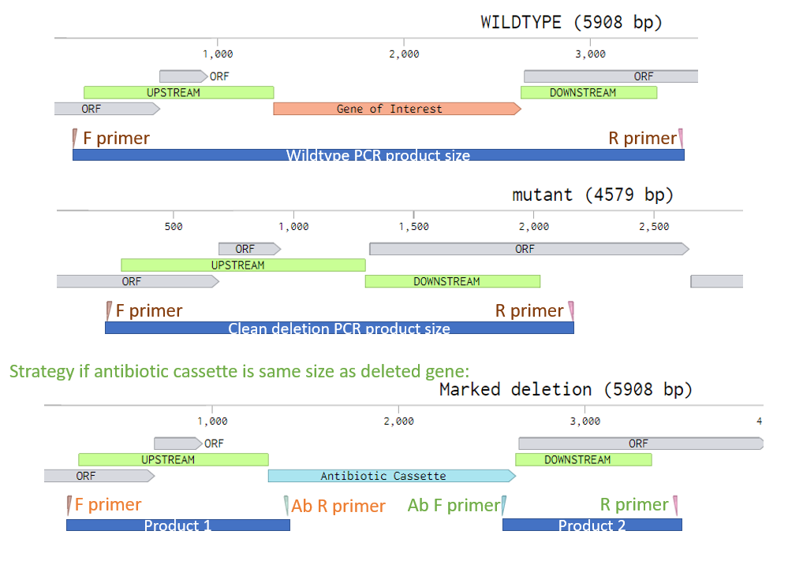

# Colony PCR

**Writing/editing credits:** Tiffany Lowe-Power

## General Tips

* Make a mastermix.
* Use a cheaper Taq-based PCR mix. 
* Less is more.  
Bacterial cells and EPS can interfer with PCR.  
If you add enough cells so that it's cloudy... that's >106 cells. 
PCR doesn't need that much DNA template.
* Colony PCR with Ralstonia straight from a plate works poorly, so see the modified protocol. 
This protocol can likely be optimized further.  

## Colony PCR for *E. coli*

This “protocol” is an outline that you should amend with manufacturer’s instructions and internet searches.

### Step 1: Create a water suspension of colonies

1. Add 50 ul sterile diH2O to PCR strip tubes with multichannel pipette.
Label the ends. 
Do 8-24 colonies per construct.
Label LB + antibiotic plate with construct name and 1-*n*.
1. With sterile toothpick, pick colonies and deposit toothpick into water. 
*Note:* toothpicks are preferred over plastic tips due to electrostatic issues with plastic. 
1. Once all colonies are picked, use the same toothpick to patch each colony onto the LB plate, taking care to keep patches from merging. 
*Note*: You can fit upwards of 50 patches per plate. 
1. Incubate LB plate in 37 C incubator overnight. 
1. Add caps to PCR strip tube and run a "lyse" thermocycler program (10 min at >96 C; hold at 22 C)

### Step 2: Colony PCR
Set up the reactions on wet ice.
If appropriate for the vector (Inspecting vector seq on Benchling can help you determine this), use M13F/R primers for PCR screen.
Alternatively, use a pair of your Gibson cloning primers to PCR screen.

1. Use Benchling to plan your PCR screen approach (i.e. which primers to use) and the ['pcr_workbook.xlsx'](workbooks/pcr_workbook.xlsx) to plan your PCR Mastermix using a cheap Taq-PCR kit. 
    * Use **2 ul of colony lysate** as the template DNA 
    * Do ≤ 20 ul reactions per colony. 
1. Prepare the mastermix, and aliquot to PCR strip-tubes.
1. Use multichannel to add 2 ul colony lysate to PCR mix. 
1. Run a PCR reaction on the thermocycler with a program that matches the PCR kit, necessary extension time, and an anneal temperature suitable with your PCR screening primers. 

### Step 3: Run Agarose Gel to determine result of PCR screen
* Use 0.8 % w/v agarose in TAE (or appropriate higher/lower agarose concentration)
* Mix 5 ul PCR product with 1 ul 6x DNA loading dye
* Image gel on XXXX in room XXX
* Print an image of the gel for your lab notebook. 
*Note:* Faint bands often print better if you invert the colors. 

## Colony PCR on *Ralstonia* colonies
*Ralstonia* has always proven tricky for colony PCR. 
I suspect this is due to the high GC genome (difficult PCR targets) and something inhibitory to the PCR (maybe EPS?). 

Only colony PCR *after* selected colonies have been re-struck for purity and grown.

### Validate the primers & PCR kit

This can be performed simultaneously with screening *put*ants (putative mutants) or while you are waiting for putants to appear. 

* Template DNA: purified wildtype genomic DNA and a boil-prep of wildtype cells.

* Perform PCR reaction as below. 

### Step 1: Prepare cell lysate / boil prep

1. Grow overnight culture in CPG (as single tubes or in 24 well plate). 

2. Transfer 50 ul culture to PCR strip tubes. 
*Note*: Consider adding glycerol to the rest of the culture (20% final vol) and saving the plate as a temporary freezer stock while you work to screen the strains. 
This way, you don't need to worry about the strains accumulating spurious mutations on the plate. 

3. Add caps to PCR strip tube and run a "lyse" thermocycler program (10 min at >96 C; hold at 22 C). 

1. Transfer tubes to -20 C until frozen.

1. Thaw. 
Spin for ~1 min in PCR tube centrifuge. *XXX Timing might need to be updated here.  Not sure if a PCR tube centrifuge will pellet cell gunk or whether this should be skipped. If pelleting is unsuccessful, maybe rewrite this steps as "add 200 ul water with multichannel to dilute PCR inhibitors in cloudy lysate"*

### Step 2: Run PCR

1. Plan your PCR screen approach as described in the section below (i.e. which primers to use) and the ['pcr_workbook.xlsx'](workbooks/pcr_workbook.xlsx) to plan your PCR Mastermix using a PCR kit that is effective with multi-kb GC-rich template DNA (e.g. Phusion). 

1. Run with controls:
    * "no template" negative controls 
    * Parental genotype negative control
    * Positive control if possible (not possible in many cases, but is possible if screening for miniTn7 integration into the genome).

1. If you identify the correct genotype, save the strain.
See: [Glycerol Stocks protocol](glycerol_stocks.md)

### Problem solving

*xxx to do: update this*

* Problem: No bands
    * Use a DNA extraction kit (e.g. Zymo xxx kit). Purify DNA.
* Problem: Bands are unexpected size
    * Gel extact the band (Zymo gel extraction kit) and submit for sanger sequencing with one of the colony PCR primers. 
    BLAST result and try to align result with Benchling plasmid maps
        * Only sequence 1 of each spuriously sized band. 
        Don't waste time / consumable resources on this if you have clones with any of the correct mutant genotypes.

## Primer Design: Detecting an unmarked deletion
* Use [PrimerBlast](primerblast.md) to identify specific primers with 
    * Opt Tm ~60 C.
    * Range that forces primers to bind outside of the upsteam/downstream regions used in the knockout vector. 
    *This is essential*. 
    See diagram below for ideal primer placement.

# Things to update on this protocol:
* link to the PCR workbook
* identity/location of the gel imager