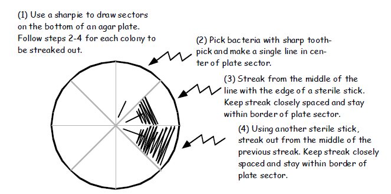

# Gene deletion in *Ralstonia*

**Writing/editing credits:** Tiffany Lowe-Power

This protocol describes the unmarked gene deletion strategy in *Ralstonia*.  
**Unmarked gene deletion** involves 
1.  a **negative selection** where antibiotic selection drives a vector to integrate into the genome next to the gene-of-interest followed by a 
1. **positive selection** where sucrose sensitivity (conferred by SacB levanosucrase expressed from the vector backbone) drives the vector to recombine out of the genome resulting in ~50% wildtype and 50% knockout genotype clones that must be genotyped by (colony) PCR

## Unmarked gene deletion (sacB)

### Clone the knockout vector:

#### Resources:
* [pUFR80 vector map with sequence](https://benchling.com/s/SGEEU7/edit)
* [Primer Design with PrimerBlast](primerblast.md)
* [Plasmid Assembly with Gibson Assembly](gibson_assembly.md)
* [Proof Checking your assembled plasmid](plasmid_proofing.md)

Clone approximately 0.9-1.2 kb upstream DNA and 0.9-1.2 kb downstream DNA adjacent to each other. 
Aim for similar sized upstream and downstream fragments so that crossovers on either flanking side are equally likely. 
Try to have the up/downstream regions immediately up/downstream from the start and stop codons, respectively. 
Take care to avoid disrupting neighboring or overlapping genes.

Suggested method: Gibson Assembly cloning in pUFR80. 
The following protocol assumes a vector containing kanamycin resistance was used, the CPG-Kan concentration was 25 μg/ml unless otherwise stated, and all solid CPG contains 0.5 % w/v TZC.

#### Introduce knockout vector into *Ralstonia* and select on kanamycin
[Electroporation](electrocompetent_cells.md), [natural transformation](natural_transformation.md), and [conjugation](conjugation_WM3064.md) are all possible strategies for introducing the vector into *Ralstonia*  

*Note: The pUFR80 knockout vector must be circular. Do not digest the vector before transformation.*

* Plate 200 μl of the transformed cells as well as 200 μl of the 10-1, 10-2, 10-3 dilutions on CPG + Kan plates. Incubate at 28C for ~2 days.

#### Counter-select on 5% w/v sucrose plates ###

1. Once single colonies appear (2 days up to 4 days), grow 2 KanR colonies overnight in CPG+Kan broth. 
*Optional: Create a temporary freezer stock in cheap 1.5 ml tubes in case the counter-selection fails*

1. Wash each in 3x in CPG without antibiotic. Dilute and plate 200 μl of the 10-1, 10-2, 10-3 dilutions on CPG + 5% w/v sucrose plates. 
*Optional: plate the dilutions on CPG without sucrose to verify* sacB *is conferring sucrose susceptibility.*

1. Once single colonies appear (2 days up to 4 days), select approximately 24 isolated colonies (transformants) and restreak on CPG for single colonies. 
Grow for 2 days at 28C or 3 days at RT. 
(Note that you can streak more than 1 transformant per plate as long as you end up with single colonies. 
See image below. [image source](http://www.sci.sdsu.edu/~smaloy/Research/pdf%20files/Basic_techniques.pdf))

1. Grow double recombinants overnight in 1.5 ml CPG in 24-well plate (28C with shaking) and perform [colony PCR](colony_pcr.md) with 3 μl culture. 
    * Note: colony PCR directly from colonies on the plate tends to yield false-negatives in EPS+ Ralstonia strains. 
    * Note 2: if short on time, add glycerol to the plate to create a temporary freezer stock until you have time to confirm the strains.*

### Re-use:
* **24-well plates**: 
Submerge in 10% bleach for >30 min. 
Rinse ~3x in diH2O. Dry in drying oven.  
Don't use for plate-reader experiments, but re-use for routine growth. 