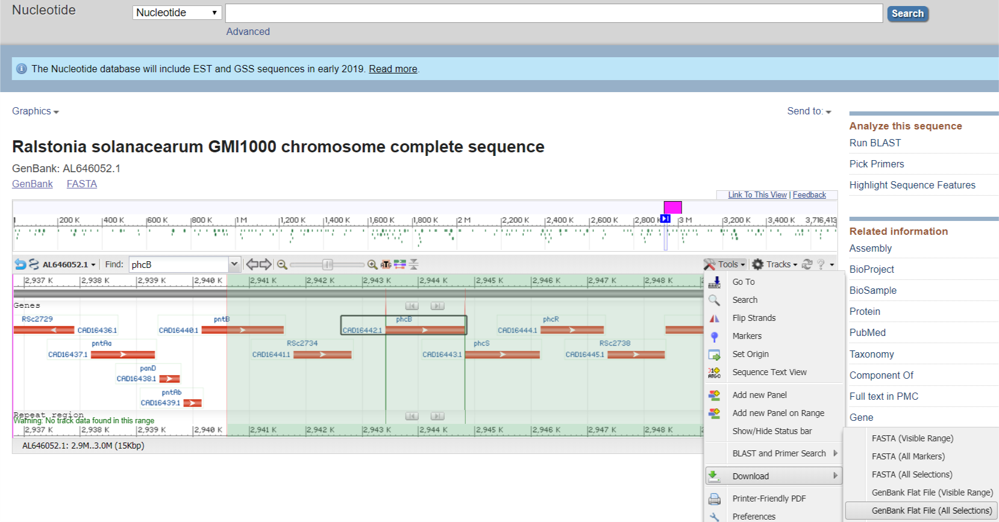
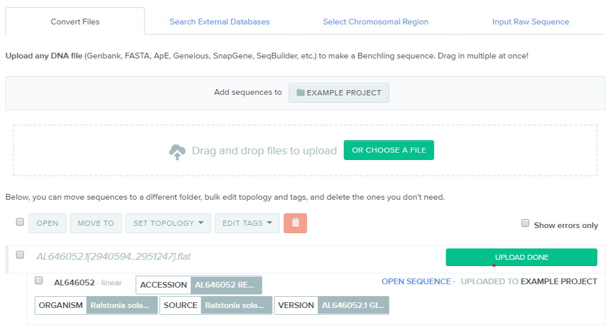
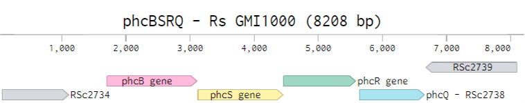
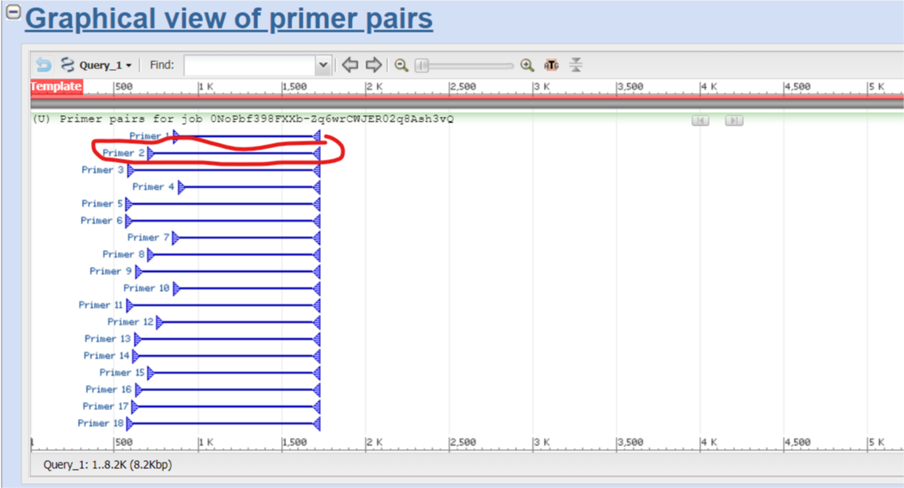
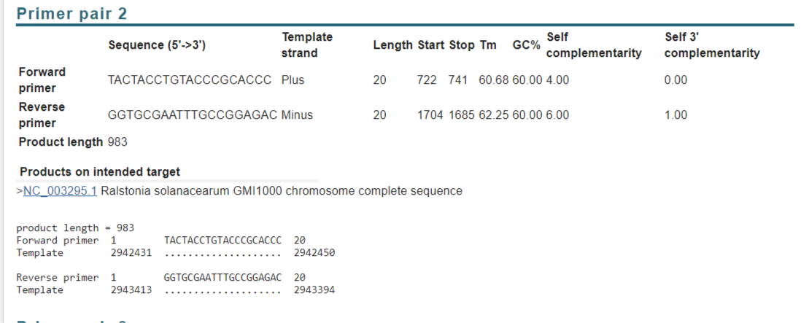
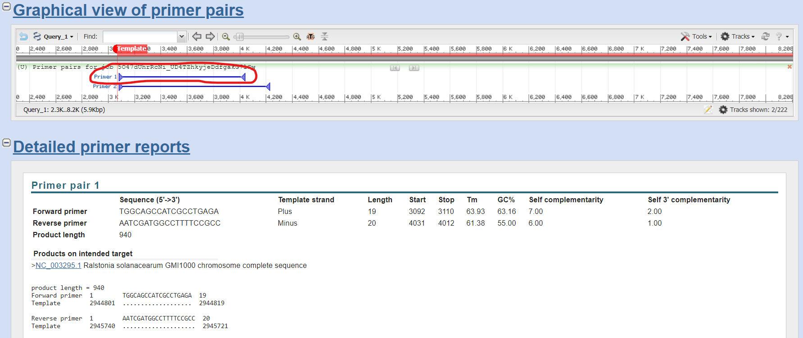

# Gibson assembly

**Writing/editing credits:** Tiffany Lowe-Power

## Resources
* [Workbook for PCR reaction calculations](xxx)
* [Workbook for Gibson Assembly rxn calculations](https://drive.google.com/file/d/1KANdtiQFYRtuiVkB5JXBvwym8x-d-JWW/view?usp=sharing)
* [Manufacturer's instructions: NEB HiFi Assembly](https://www.neb.com/products/e2621-nebuilder-hifi-dna-assembly-master-mix)
* [Background Reading on Gibson Assembly](http://en.wikipedia.org/wiki/Gibson_assembly)
* [Another protocol for Gibson](http://openwetware.org/wiki/Janet_B._Matsen:Guide_to_Gibson_Assembly)
* [Benchling](benchling.com) for plasmid maps.  Create an account and email Tiffany with your account name to be added to the lab Benchling organization.

## Part 1: Planning & Design the Vector
**Assign a systematic name to your vector,** e.g pTLP1, pTLP2, etc.

Use Benchling to plan your vector. 
Also create a dated CloningPlan.docx to explain your cloning plan. 
Gratuitously fill it with screenshots & copy/pastes of the *in silico* results.

As a case study, this protocols shows how to delete *phcB* from *R. pseudosolanacearum* GMI1000. 
This involves inserting two PCR products into a parental vector.
Gibson assembly can also be used to insert 1 product into a vector (e.g. for complementations) or 3 products into a vector (e.g. for a marked antibiotic deletion). 
As product # increases, success decreases.
For complex projects, you may want to do a two-step assembly.

### Create a Gene locus entry in Benchling.
Protip: You can export a region of DNA sequence from the nucleotide *graphics* view on NCBI. 
The `Genbank Flat File` will have annotations that Benchling can ~read. Upload this into benchling & tidy it up.

After tidying, gene locus may look like this:

[live link to the wildtype locus](https://benchling.com/s/seq-LdA7kp7esUiuZhGqPGeJ)

## Use [PrimerBlast](https://www.ncbi.nlm.nih.gov/tools/primer-blast/) to identify the target-specific-portion of the primer.
Gibson assembly primers have two parts. 
The 5' end is designed to overlap the neighboring fragment as a reverse-complement.  
The 3' end of the primer a "normal PCR primer" and is specific to the DNA target. 
I call the 3' end the "target-specific-portion".

* See general [PrimerBlast protocol](primerblast.md).

* For this tutorial, I used these parameters to target the upstream and downstream regions. 
*Note: Because of how NCBI allows you to save parameters, I had to delete the PCR template sequence.  
But you can copy it from the Benchling link above)*
  * [Upstream parameters][upstream params link]
  * [Downstream parameters](). *I forgot to save this. Oh well. Maybe someone can fill something in here*

Looking at results from PrimerBlast:

Upstream:

Downstream:

* Copy the screenshots of the graphical view into your CloningPlan.docx
* Copy the primer tables as live-text into your CloningPlan.docx (That way you/others can copy/past the primers later)

### Annotate the Benchling Gene Locus with the Upstream and Downstream regions
Generally, I create annotations called "temp" for each of these target-specific-primers. (e.g CTRL+F > paste *primer seq* > Right click on selection > create new annotation). 
Then I can use these to precisely select the intended region. (Click *temp1* > hold down shift and click *temp2*). 
I then create *Upstream* and *Downstream* annotations as shown in the [Benchling window](https://benchling.com/s/seq-LdA7kp7esUiuZhGqPGeJ).

## Use NEBuilder to design the "gibson overlap" portion of the primer.

* [NEBuilder link](https://nebuilder.neb.com/#!/)

### Adjust `Settings`.  
If you deviate from these standard settings, note the changes & the reason in your CloningPlan.docx.

* Product / Kit: **NEbuilder HiFi DNA Assembly Master Mix**
* Minimum overlap: **20**
* Circularize: **Yes**
* Other settings:  Doesn't really matter if you're using Kapa Hifi, the Ralstonia-preferred polymerase.  

### `Build`

#### Add Fragments
Add vector: `+New Fragment`
* `Paste Sequence` Locate the vector pUFR80 on benchling & paste it: [Link](https://benchling.com/s/SGEEU7/edit).
 Select **Vector** and **Circular**. 
 Name it. 
 Select **Fragment DNA will be produced by** `Restriction Digest`. 
 The enzymes **HindIII** and **EcoRI** are compatible and create good overlaps for Gibson in pUFR80. 
    * Good overlaps don't have a lot of palindromic region that can self-base pair in the 50C Gibson reaction (so, by definition most *MCS* multi cloning sites are bad choices). 
    * The [Oligo Analyzer tool](https://www.idtdna.com/calc/analyzer) helped me identify optimal enzymes for good overlaps. 
    * Try to use the same enzyme(s) each time you use a certain vector so you can bulk-digest it & store it linearized in the freezer. 
    * If using multiple enzymes, ensure they are compatible in the same buffer and have the same temperature (There are a few 25C and 60C weirdos).
* Add Fragment.

Add each insert: `+New Fragment`
* `Paste Sequence` Copy/paste the upstream region. Name it. Select **Fragment DNA will be produced by** `PCR`. 
*Important*: Do not do 'Specify Custom Primers' if you want NEBuilder to design overlaps for you.  
* Add Fragmet.

#### Check the assembly
* Make sure fragments are the expected sizes and in the expected order.  
Change as needed.

#### Export the data `Summary`
*Note for someone to edit/delete... 
These options on NEBuilder have been improved since Tiffany last cloned. Someone else can edit this to create the  lab SOP*
*  Add a screenshots to your CloningPlan.docx. 
(Make sure it includes the restriction enzymes or else you'll be frustrated at the bench)
*  Copy the 'Required Oligonucleotides' table into your ClongingPlan.docx & add a systematic name  (tlp1 ... ) in front of descriptive name (phcB_Up_fwd). 
Copy primers to your personal primer spreadsheet (See the lab template for easy bulk ordering through IDT), and bulk-add them to Benchling as oligos.  
* Download **'Assembled Sequence'** and import it into Benchling. 
In Benchling, use the Annotations > Autoannotate feature to add the pUFR80 and gene locus annotations. 
Attach primers after you've imported them into Benchling.
* `Load/Save` Download the .json file and save in your files in case you need to modify this plan later.

### Order your primers
* Also consider designing and ordering primers to help you PCR screen your mutants ([Described in Colony PCR protocol](colony_pcr.md))
* When primers arrive, reconstitute the lyophilized primer to 100 uM Tris buffer pH 8.0. 

## Part 2: Preparing the fragments & Gibson Assembly

### Digesting the Vector
* Miniprep the Vector
* Digest 2-25 ug of the vector in a 50-100 ul reaction. 
Follow manufacturer's instructions on the amount of enzyme, buffers, time. 
Try to avoid the need for a gel extraction by adding a slight excess of enzyme & digesting for a sufficient amount of time.
  * *Note*: if digesting a lot of DNA, it's better to increase reaction volume to improve enzymes' access to DNA.
  * Optional: Run vector on the gel to confirm thorough cutting. 
  Use uncut vector as negative control. 
  I usually skip this unless I have to troubleshoot later.
* Clean up plasmid with Zymo DNA Clean & Concentrator kit and an appropriate spin column 
(i.e. make sure it has the capacity to bind the amount of DNA you are adding. 
You can use the 25 ug miniprep columns with the Clean & Conc buffers).

### PCR Amplification of the Inserts
* **Polymerase choice**: Use a high fidelity enzyme (Kapa HiFi or NEB Q5). 
Kapa HiFi with the GC buffer is very effective at amplifying the high GC (>65% avg) *Ralstonia* genome.
  * Use ['PCR_workbook.xlsx'](workbooks/PCR_workbook.xlsx) to prepare your PCR reactions.
  * Amplify according to manufacturer's instructions. 
  * Variables to adjust: 
    * Extension time depends on product length & polymerase. 
    * Anneal temp depends on buffer composition as well as primer composition. 
    I always like the Kapa HiFi advice: Start with 60C as an anneal (or a gradient temp anneal) and increase/ decrease anneal temp depending on results.

* Run reaction on Agarose gel to confirm amplification
  * Gel: Usually 0.8% agarose in TAE, but higher/lower agarose concentrations can be used to get optimal resolution of small/large fragments).
  * Mix 2 ul reaction + 3 ul water + 1 ul 6x DNA loading dye
  * Run next to 1 Kb+ or appropriate DNA ladder.
  * Image on XXX

* If PCR was specific (a single bright band), use the Zymo DNA clean & concentrator kit to clean up the PCR product.
  * If the PCR has nonspecific bands, decide whether to run the remaining reaction on a gel & gel extract it (Zymo Gel extraction kit) or optimize the PCR rxn.

### Gibson assembly
* Quantify DNA on nanodrop
* Use ['assembly_workbook.xlsx'](workbooks/assembly_workbook.xlsx) to calculate reactions
  * If using newly prepped plasmid backbone, include a "no insert" negative control in the Gibson reaction + *E. coli* transformation
  * Although manufacturer recommends 20 ul reaction, 10 ul reactions work great & save money.
* Thaw a 50 ul aliquot of the NEB HiFi Assembly mix (#E2621L) on ice.
* Prepare reaction and incubate in thermocycler at 50C for 15-60 min.
  * If assembling many constructs into a plasmid, it can be helpful to mix everything except the vector backbone (mix+water+inserts), and incubate at 50 for 10 minutes before adding in the backbone.

## Transform *E. coli*
Follow the transformation protocol in the [Mix&Go E. coli kit](ecoli_chem_comp.md).
* For some *E. coli* backgrounds, NEB recommends diluting the Gibson reaction 1:4 due to buffer toxicity to some cells. 
This is not necessary for the Zymo Mix&Go preps of NEB5alpha *E. coli*. 
* If vector allows Blue-White screening, don't forget to add XGal+IPTG to your LB.

## Verify the vector
Use [Sanger sequencing](sanger.md) to verify the plasmid. Save correct clones as glycerol stocks in -80.

[upstream params link]: https://www.ncbi.nlm.nih.gov/tools/primer-blast/index.cgi?LINK_LOC=bookmark&PRIMER_RIGHT_INPUT=ggtgcgaatttgccggagac&OVERLAP_5END=7&OVERLAP_3END=4&PRIMER_PRODUCT_MIN=800&PRIMER_PRODUCT_MAX=1200&PRIMER_NUM_RETURN=20&PRIMER_MIN_TM=57.0&PRIMER_OPT_TM=61.0&PRIMER_MAX_TM=66.0&PRIMER_MAX_DIFF_TM=3&PRIMER_ON_SPLICE_SITE=0&SEARCHMODE=0&SPLICE_SITE_OVERLAP_5END=7&SPLICE_SITE_OVERLAP_3END=4&SPAN_INTRON=off&MIN_INTRON_SIZE=1000&MAX_INTRON_SIZE=1000000&SEARCH_SPECIFIC_PRIMER=on&EXCLUDE_ENV=off&EXCLUDE_XM=off&TH_OLOGO_ALIGNMENT=off&TH_TEMPLATE_ALIGNMENT=off&ORGANISM=Ralstonia%20solanacearum%20GMI1000%20%28taxid%3A267608%29&PRIMER_SPECIFICITY_DATABASE=refseq_representative_genomes&TOTAL_PRIMER_SPECIFICITY_MISMATCH=1&PRIMER_3END_SPECIFICITY_MISMATCH=1&MISMATCH_REGION_LENGTH=5&TOTAL_MISMATCH_IGNORE=6&MAX_TARGET_SIZE=4000&ALLOW_TRANSCRIPT_VARIANTS=off&HITSIZE=50000&EVALUE=30000&WORD_SIZE=7&MAX_CANDIDATE_PRIMER=500&PRIMER_MIN_SIZE=15&PRIMER_OPT_SIZE=20&PRIMER_MAX_SIZE=25&PRIMER_MIN_GC=20.0&PRIMER_MAX_GC=80.0&GC_CLAMP=0&NUM_TARGETS_WITH_PRIMERS=1000&NUM_TARGETS=20&MAX_TARGET_PER_TEMPLATE=100&POLYX=5&SELF_ANY=8.00&SELF_END=3.00&PRIMER_MAX_END_STABILITY=9&PRIMER_MAX_END_GC=5&PRIMER_MAX_TEMPLATE_MISPRIMING_TH=40.00&PRIMER_PAIR_MAX_TEMPLATE_MISPRIMING_TH=70.00&PRIMER_MAX_SELF_ANY_TH=45.0&PRIMER_MAX_SELF_END_TH=35.0&PRIMER_PAIR_MAX_COMPL_ANY_TH=45.0&PRIMER_PAIR_MAX_COMPL_END_TH=35.0&PRIMER_MAX_HAIRPIN_TH=24.0&PRIMER_MAX_TEMPLATE_MISPRIMING=12.00&PRIMER_PAIR_MAX_TEMPLATE_MISPRIMING=24.00&PRIMER_PAIR_MAX_COMPL_ANY=8.00&PRIMER_PAIR_MAX_COMPL_END=3.00&PRIMER_MISPRIMING_LIBRARY=AUTO&NO_SNP=off&LOW_COMPLEXITY_FILTER=on&MONO_CATIONS=50.0&DIVA_CATIONS=1.5&CON_ANEAL_OLIGO=50.0&CON_DNTPS=0.6&SALT_FORMULAR=1&TM_METHOD=1&PRIMER_INTERNAL_OLIGO_MIN_SIZE=18&PRIMER_INTERNAL_OLIGO_OPT_SIZE=20&PRIMER_INTERNAL_OLIGO_MAX_SIZE=27&PRIMER_INTERNAL_OLIGO_MIN_TM=57.0&PRIMER_INTERNAL_OLIGO_OPT_TM=60.0&PRIMER_INTERNAL_OLIGO_MAX_TM=63.0&PRIMER_INTERNAL_OLIGO_MAX_GC=80.0&PRIMER_INTERNAL_OLIGO_OPT_GC_PERCENT=50&PRIMER_INTERNAL_OLIGO_MIN_GC=20.0&PICK_HYB_PROBE=off&NEWWIN=on&NEWWIN=on&SHOW_SVIEWER=true