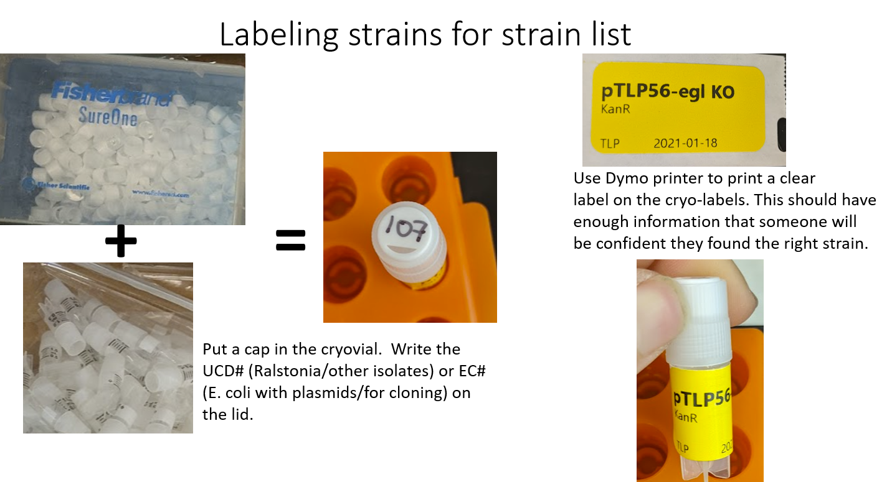

# Glycerol stocks

**Writing/Editing Credit**: Tiffany Lowe-Power + inspiration from Mark Mandel

**TL;DR Store strains 25% v/v glycerol (final concentration).**

## Labeling tubes

- It is important to label tubes clearly. It is possible that someone will try to find you strain in 2 decades. Please make it easy. I recommend labeling like below: 

## EC collection overview

E. coli carrying plasmids / used in cloning are part of our EC collection. Each strain gets an EC number. We store this collection as single vials (not backed up in the basement -70C).  If these strains die in a melt down, we should be able to miniprep the plasmid out & re-transform into fresh E. coli. So it's not worth the effort to back them up. 

### When to save down E. coli?

Save down your E. coli after you have Sanger Sequenced the plasmid and confirmed them as correct. Add the strain to the strain list and label a cryovial. Make an LB + antibiotic overnight culture. Mix with sterile 50-75% glycerol to 15-25% v/v glycerol final concentration. Close tube. Invert 10x to mix. Then give tubes a hard "wrist flick" motion to ensure the liquid is at the bottom of the tube (not on the lid). Put in the appropriate location in the E. coli freezer box. (double check that it's the right spot based on the strain list.)

## UCD collection overview

A strain that is added to the laboratory strain database is assigned an UCD number and stored in duplicate boxes (located in the 275 -70C freezer and our basement -70C freezer).

Strains that are *in progress* should be stored as 2 ml cultures in your personal box. When they are confirmed to be correct, then they are assigned an UCD number and logged into the strain database. The culture will be thawed on ice and moved to the permanent -70C locations. 

When possible, it is a **great** idea to prepare large numbers of tubes ready to go with glycerol. 
This improves sterile handling and avoids any barriers to saving important strains. 
Additionally, the tubes can be autoclaved after glycerol addition to assure sterility.

### When to save down Ralstonia/other bacteria?

Save down your Ralstonia ASAP.  As bacteria grow & divide, they accumulate random mutations. We don't want to study random mutations. Ralstonia does not tolerate 4C very well, so we should only store plates at 28C (for 2-3 days) or on the bench. This means that we should store Ralstonia mutants/engineered strains before we have finished confirming their genotypes. 

Choose 3-10 individual colonies / genotype to save down (See Note 1). Create overnight liquid cultures in CPG + 50% antibiotics (if appropriate--50% because antibiotics reduce growth more in liquid media); grow 28C with shaking.  In labeled 2 ml tubes, save down strains by mixing with sterile glycerol to 20-25% v/v final concentration of glycerol. Save ~2 ml of culture.  Close tube. Invert 10x to mix. Then give tubes a hard "wrist flick" motion to ensure the liquid is at the bottom of the tube (not on the lid). Save in your personal -70C box -- I recommend keeping an "name's unconfirmed strains" box. Use the remaining overnight culture to perform colony PCR or DNA extraction in order to confirm the genotypes.

After you have confirmed the genotype, choose 1-2 strains to save to the permanent strain list. Thaw the 2 ml cryovial in ice (make sure it's completely covered.) Label two 1 ml cryovials with permanent labels. Transfer ~1 ml of culture to the 2 vials.  Store in the "UCD Box #" boxes in the 275 -70C freezer and the basement -70C freezer. 

Note 1: If you have created a markerless KO using the sacB/pUFR80 method, you should save down 10 colonies. >50% of these strains will have the wildtype genotype. If you are using the MiniTn7 vector, these strains are almost always correct and you can save down 3. 

# Water Stocks
 
 * Use sterile screw-cap tubes with the rubber gaskets.
 
 To a sterile tube filled with sterile distilled water, add one or more loops of bacteria from single typical colonies on a fresh CPG plate (without TZC, because the TZC reduces viability slightly). 
 Vortex. 
 Stock should not be cloudly/turbid: do not overload. Apparently waterstocks last better if at a low density. 
 Store water stock tubes at room temperature. 
 Water stocks of *R. solanacearum* remain viable for decades; Allen lab in Wisc is still using one from 1962. That said ... they probably mutate when in water stocks. 

 ## Large-scale preparation of individual cryotubes tubes, each containing 50% glycerol

- Lay out tubes in a rack
- Unscrew tube caps but leave caps on tubes.
- Prepare 50% glycerol solution in a 250 ml bottle. 
Add equal volumes of 100% glycerol and dI H2O.

*Mix well to distribute the viscous glycerol solution.* 
Using a serological pipet or the P1000 multichannel, add the volume listed below to each tube. 
Slightly close the top on each tube but do not fully seal. 
Add autoclave tape to each rack and autoclave the racks. 
After cooling, seal each tube firmly and place on shelf.