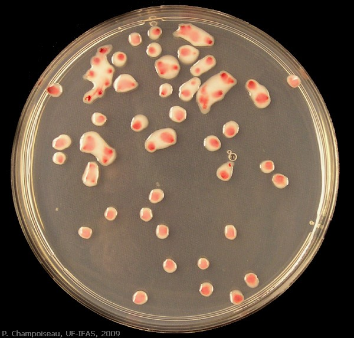
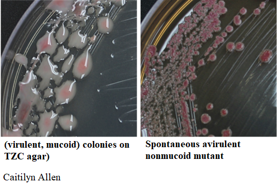

## Culture and Maintenance of plant pathogenic *Ralstonia*

**Essential Reading**: [Kelman 1954 *Phytopathology*. "The relationship of pathogenicity in *Pseudomonas solanacearum* to colony appearance on a tetrazolium medium".](resources/Kelman_1954_essential_reading.pdf)

*Note: *Ralstonia solanacearum* was referred to as *Pseudomonas solanacearum* up until 1990s, was briefly called *Burkholderia solanacearum*, and then the *Ralstonia solanacearum* species complex. Work by Prior, Fegan, and others split the complex into 3 species: *Ralstonia pseudosolanacearum* (all phylotype I and III strains, including GMI1000), *Ralstonia solanacearum* (all phylotype II strains like K60, AW1, UW163, and IBSBF1503), and *Ralstonia syzygii* (all phylotype IV strains like PSI07, R24, and the "banana blood disease" strains).

### Colony Morphology
*Ralstonia* colonies are fluidal, mucoid and irregular in shape.
On CPG+TZC plates, the colonies have a white or light pink appearance, with dark pink or red centers. 
Colonies should not be visible until 36-48 hours after streaking at 28˚C. 
Colonies that are visible by 24 hours are not *R. solanacearum*. 

TZC (tetrazolium chloride) is a redox indicator that helps you keep an eye on Ralstonia colony morphology (see phc mutants section). 

*R. solanacearum* strain GMI1000 growing on TZC plates at 28˚C for 55 hours:

#### Beware of spontanenous phc mutants
CAUTION: Beware of small, round, dark red, non-mucoid colonies surrounded by reddish-brown melanin pigment. 
*Ralstonia* spontaneously forms avirulent mutants, especially after storage in waterstock. (These are usually mutated in the Phc quorum sensing system.)  

### Waterstocks

Bacterial -70 C glycerol stocks can lose viability and pathogenicity during subtle thaw/freeze events. To preserve these long-term stocks, our lab members routinely creates "waterstocks" of Ralstonia isolates that they are actively using in their project.

Best practices:
* **Waterstocks should be kept personal to the individual researcher** to decrease the likelihood you contaminate your labmate's waterstock. If you are sharing a stock with someone new (undergrad mentee, rotation student, etc), you can divide your water stock 
* Label waterstocks with strain, initials, and the date is was created.  When waterstocks exceed 6-12 months of age or colony morphology changes, create a fresh waterstock from the -80 cultures. 
* Keep water stocks in a drawer so that they are not exposed to light / UV radiation which can accelerate mutation acculation. 
* Currently we don't use any genetic systems that involve plasmids that replicate independently from the chromosome & require antibiotics to ensure the plasmid is maintained by the strain. If we start using a strain with an artificial plasmid, we should pull it from -70 stocks every time. (pBBR1-origin plasmids like pUFJ10 can replicate in Ralstonia, but they often make Ralstonia strains look 'sick' on plates, so we try to stick with chromosomal integration systems like Tn7.)

Methods:
* Add 1 ml sterile MQ H2O to a 1.0-2.0 ml **Screw cap** sterile tube. *Screw cap tubes will seal more effectively and prevent stock from dehydrating*. Label waterstocks with strain, initials, and the date is was created.
* Create a waterstock by picking a single, isolated colony from a CPG plate that doesn't have TZC (empirically waterstocks from TZC plates don't last as well as plain CPG). Waterstock should be quite dilute and just barely turbid. 
* Store at RT away from light in a box labeled "Your name Water stocks". 
* Only open waterstocks in a laminar flow hood or biosafety cabinet so that air fungi don't colonize your tube. 
* Bacteria will settle to the bottom of the tube.  Invert tube 2-3x to resuspend the bacteria.  Then "wrist flick" the tube so that the suspension is in the tube & there aren't large droplets on the lid. Then open tube and dip a sterile stick into the tube to barely wet it.  Streak out bacteria on a plate using the wet end of the stick. Reseal tube.  
   * If streaking from multiple waterstocks at a time, conduct your work so that you do not cross-contaminate your stocks. Suggestions: Only have 1 tube open at a time.  Ensure you use a fresh stick for each tube. Do not rush. 

### Working with natural isolates in Boxes 3-6. 

   *  Note, the natural isolates in UCD Boxes 3-6 (UCD163-UCD459) were acquired after multi-year to multi-decade storage in waterstocks in the Allen lab. When Tiffany replicated this collection from the Allen lab, some of the waterstocks had multiple colony morphologies (indicating mutation accumulation). Single colonies were restruck for purity before saving in our collection, but due to the magnitude of work, some of these isolates may be mixed populations. So every time you work with a new isolate in this range, you should first streak out the strain on CPG+TZC to determine whether the culture is homogenous or has multiple colony morphologies.  If there are multiple colony morphologies, discuss with Tiffany and she will pick a "virulent looking" colony to work with.
   *  Once you have a good-looking colony that's isolated from other colonies (might require a second streak on CPG+TZC to ensure purity), make a new glycerol stock from that colony and also streak it on CPG plates without TZC to make a medium-term water stock. You can use the same wooden stick to inoculate both cultures at the same time. Cross out, but do not delete, the previous mixed culture from the strain list & make a note to "See UCD###" which indicates the new pure strain that your future labmates should work with.  

### Misc. Advice

* Do not store *Ralstonia* at 4C or above 35C if you want to use them for experiments.
    * If you want to halt growth on dilution plates, you can store them at 4C short term. 
* Keep plates of *Ralstonia* for no longer than 1 week before restreaking the strain from a glycerol or water stock. 
    * Do not repeatedly transfer bacteria from plate-to-plate. They will evolve to be great at growing on plates. They will lose virulence. 
    * Generally 2 days at 28 C, then at RT for up to 1 week total on the plate.
    * If you want Ralstonia to grow slower, you can incubate them on the bench at RT to get colonies in 3 rather than 2 days.  But still don't use plates older than 7 days. 
* When using erlenmeyer flasks, keep broth volume less than 50% of the flasks "capacity" to ensure proper aeration and growth of the bacteria. 
If you need more bacteria, use a larger flask or multiple flasks.
* If you are making a new strain, it can take up to 3-4 days for colonies to appear on a selection plate.  Then, subsequent streaks of the bacteria will form visible colonies at the normal rate (2 days)
* Take quick cell phone photos of your strains on plates -- every time you work with a new isolate or make a new strain.  This documentation will help you catch problems (or maybe interesting data, but probably problems) if colony morphology is unexpected. 
