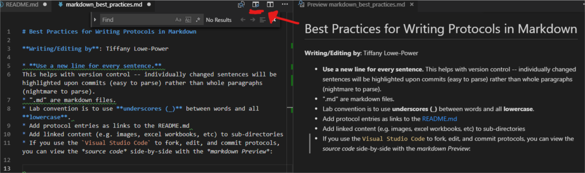

# Best Practices for Writing Protocols in Markdown

**Writing/Editing by**: Tiffany Lowe-Power

* **Use a new line for every sentence.** 
This helps with version control -- individually changed sentences will be highlighted upon commits (easy to parse) rather than whole paragraphs (nightmare to parse).
* ".md" are markdown files.
* Lab convention is to use **underscores (_)** between words and all **lowercase**. 
* Add protocol entries as links to the README.md 
* Add linked content (e.g. images, excel workbooks, etc) to sub-directories
* If you use the `Visual Studio Code` to fork, edit, and commit protocols, you can view the *source code* side-by-side with the *markdown Preview*:

