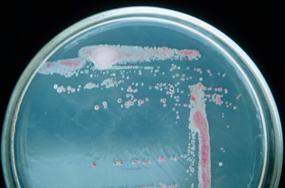

# Media

**Writing/editing credits:** Tiffany Lowe-Power

***XXX Someone should create a table of contents for this***

## General Information
For plates, add 15 g Agar / L and a stir bar. 
Cool in the 55 °C bath prior to pouring, until the media can be touched with bare hands. 
Add [antibiotics](antibiotics.md) if required. 
Stir for approximately 1 min, then pour.

All recipes are reported as per L

1 L solid media will prepare 40 thick plates (*Ralstonia maintainence*) or 50-55 thin plates (*E. coli* or *Ralstonia* dilution plating)

# Rich Media

## CPG: 

RED stripe = CPG + TZC plates 

BLACK stripe = CPG plates (no TZC; used for water stock prep)

`Casamino Acids-Peptone-Glucose (yeast extract)`

|           Amount per L| Reagent                |
|-----------------:|:-----------------------|
|              1 g | Casamino acids         |
|             10 g | Bacto-Peptone          |
|              5 g | Glucose (Dextrose)     |
|              1 g | Yeast extract          |
| to 1000 ml total | with dI H2O |

For solid CPG media, always add 1 ml 1% TZC per 500 ml media after media is autoclaved and cooled. 

*Note: Some Ralstonia labs call this media "BG" media*

## LB

BLUE stripe = LB plates 

[`Lysogeny Broth`](https://www.ncbi.nlm.nih.gov/pmc/articles/PMC321500/)

|  Amount | Reagent           |
|--------:|:------------------|
|    25 g | LB Broth powder   |
| 1000 ml | dI H2O |

*Note: Above is equivalent to:*

|           Amount per L | Reagent                |
|-----------------:|:-----------------------|
|             10 g | Bacto-tryptone         |
|              5 g | Yeast extract          |
|             10 g | NaCl                   |
| to 1000 ml total | with dI H2O |

## NYGA

|           Amount per L | Reagent                |
|-----------------:|:-----------------------|
|              5 g | Peptone                |
|              3 g | Yeast extract          |
|            20 mL | Glycerol               |
| to 1000 ml total | with dI H2O |

# Minimal Media

## 1/4 M63  Medium
Also referred to as 'BMM / Boucher's Minimal Medium' after the researcher who determined that this Na-free medium was suitable for *Ralstonia* growth.  

*Note*: This medium has a low-buffering capacity so depending on final pH of medium, Tris or MES can be added (10 mM final concentration). 

This recipe has been updated as of 04/18/2024 based on an improved recipe developed by Remi Peyraud. In particular, our recipe now includes the addition of an trace elements solution that is added to the standard BMM recipe. 

To prepare one liter of **2x concentration minimal media** (aka 1/2 M63):

1.) Prepare separate stock solutions:
   -Dissolve 2.5 g of (NH4)2SO4 (ammonium sulfate) in 50 mL of water
   -Dissolve 0.5 g of MgSO4, 7H2O (magnesium sulfate heptahydrate) in 50 mL of water
   -Dissove 0.125 g FeSO4, 7H2O (Iron (II) sulfate heptahydrate) in 50 mL of water
   
2.) Prepare a potassium sulfate base solution by dissolving 6.8 g of KH2PO4 in 800mL of water

3.) Add the portions of the stock solutions to the potassium sulfate solution (volumes to add below)

| Chemical solution | Volume to add |
|------------------:|:--------------|
| Ammonium sulfate  | 20 mL         |
| Magnesium sulfate | 10 mL         |
| Iron (II) sulfate | 0.1 mL        |

4.) Bring the total volume of the combined mineral solution up to 1 L.

5.) Adjust the pH of the solution to 6.5-7 using 10 M KOH (potassium hydroxide)

6.) Filter using a 0.22 micron-sized porous filter. **DO NOT AUTOCLAVE to sterilize**, this will change the pH and precipitate out some of the chemicals in the solution. This is the standard 2x concentration minimal media recipe without the addition of Remi's added trace elements solution. 

To prepare a 1000x trace element solution:

1.) Prepare an iron solution. The recipe for this solution is below, combine the chemicals in the order they are listed.

| **Amount per 100 mL** | **Reagent**                         |
|----------------------:|:------------------------------------|
|                1.25 g | FeSO4, 7H2O   |
|                12.5 g | Na2EDTA, 2H2O |

2.) Adjust the pH with 10 M KOH of the iron solution until all of EDTA has dissolved. The solution should be golden yellow and the pH will likely be around 8.

3.) Prepare an incomplete trace element solution. The recipe is below, combine the chemicals in the order they are listed.

| **Amount per 100 mL** | **Reagent**                                                               |
|----------------------:|:--------------------------------------------------------------------------|
|                5.50 g | ZnSO4, 7H2O                                         |
|                2.85 g | H3BO3                                               |
|                1.26 g | MnCl2, 4H2O                                         |
|                0.40 g | CoCl2, 6H2O                                         |
|                0.39 g | CuSO4, 5H2O                                         |
|                0.28 g | (NH4)6Mo7O24, 4H2O |

4.) Combine the Iron solution with the incomplete trace element solution. 

5.) Adjust the pH of the solution to 6.5 using 10 N KOH.

6.) Bring up the volume of the solution to a final volume of 250 mL.

7.) Filter using a 0.22 micron-sized porous filter. **DO NOT AUTOCLAVE to sterilize**, this will change the pH and precipitate out some of the chemicals in the solution. This is the standard 2x concentration minimal media recipe without the addition of Remi's added trace elements solution. 

This complete trace element solution will initially be bright green, however it will slowly turn purple in storage. **Store at 4 degrees celsius**

Dilute the 2x minimal media solution to 1x using sterilze DI water and add the 1000x to the 1x minimal media so that it is diluted to a final concentration of 1x. 

Growth curve data for this minimal media recipe can be seen below. Wild-type _R. pseudosolanacearum_ GMI1000 was the strain grown.

# Specialized Media

## Modified Semi-Selective South Africa Medium
Purpose: To select *Ralstonia* from environmental samples where competing microbes may overgrow a plate

|     Amount per L | Reagent                |
|-----------------:|:-----------------------|
|              1 g | Casamino acids         |
|             10 g | Bacto-Peptone          |
|             5 ml | Glycerol               |
| to 1000 ml total | with dI H2O |

* [Autoclave](autoclave.md)
* Allow to cool to 55C before adding filter-sterilized screening and selective agents:

Screening agents (color differential)
|     Amount per L | Reagent                | Stock concentration  % w/v|
|-----------------:|:-----------------------|:-------------------|
|        5 ml | 2,3,5-Triphenyltetrazolium chloride (TZC) | 1 % |
|             500 ul | Crystal Violet         | 1% |

Selective agents (expensive, prepare fresh in 20 ml and add to 1L SMSA or scale up and store at 4C to use within 1 month)

|     Amount per L | Reagent                |
|-----------------:|:-----------------------|
|           100 mg | Polymyxin B Sulfate (Sigma P-1004) |
|           100 mg | Cycloheximide (Sigma 01810) |
|            25 mg | Bacitracin A (Sigma B-0125)   |
|  500 ul of 0.1% w/v | Penicillin G (Sigma P-3032)   |
|  500 µl 1% solution (w/v) |  Chloramphenicol  (Sigma C-3175) |
| to 1000 ml total | with dI H2O |
Polymyxin B is expensive. Unless sampling from field, leave this out.

**Citation:** [Elphinstone J, Hennessey J, Wilson J, Stead D. 1996. Sensitivity of different methods for the detection of Ralstonia solanacearum in potato tuber extracts. EPPO Bull. 26: 663-678.],  as modified by Maria Julia Pianzzola, Universidad de la Republica, Uruguay (personal communication). 

*Note:* Growth of Ralstonia on SMSA will be slow. Colony morphology of *R. solanacearum* after 3 day incubation at 28C:

 

# Making media

### General information

* Rich media components (e.g. peptone, casamino acids, yeast extract) are dusty & scum up the inner workings of the sensitive microgram scale (surrounded by cover), so use the less sensitive scale.
* Wear gloves while making media
* When making media to be autoclaved, make sure the volume of the container is twice that of the amount of media you are autoclaving (i.e. if you are making 1 L of media, make it in a 2 L bottle/flask to autoclave it)
  * Too small of a container will result in boil-over
* Clean the media preparation area when finished making media
  * Dust off the scale / make sure its doors are closed

### Liquid media
1. Make media and measure out in 100 mL aliquots into milk dilution bottles
2. Put lids on bottles loosely (don't close all the way or else pressure may cause explosion)
3. Fold edge of autoclave tape (for easy removal) and place on seam between lid and bottle. 
4. Put bottles in square metal cage 
    * *Note*: This might need updating depending on autoclave type in building
5. [Autoclave](autoclave.md)
6. After autoclaving, let bottles cool at room temperature until you can touch them with bare hands, then tighten the caps.
   * Important to tighten caps after cooled, or else they will get stuck on.
7. Put media away on designated shelf.

### Plates
1. Make media in appropriately sized flask with stir bar if pouring same day
    * *Alternatively*: Make in appropriately sized bottlw without stir bar. 
    This can be re-melted in the microwave at a later point.
2. Add 15 g agar per 1 L of media (makes 1.5% agar plates)
3. Cover top of flask with aluminum foil and place autoclave tape on top
    * Or loosely cap bottles, as with liquid media.
    * Generally make solid CPG as 500 ml in 1 L bottles and keep shelf stocked with solid LB at both 250 ml in 500 ml bottles and 500 ml in 1 L bottles
4. Turn on 55°C water bath.
4. [Autoclave](autoclave.md)
    * For storage of solid media in bottles, label with lab tape (folded edge):
        * Media type
        * Date made
        * Your initials 
    * Or re-melt media in microwave. ***xxxSomeone should update this with recommendations on power settings / time for both CPG and LB. The salts in LB make it likely for LB to volcano in the microwave if you aren't careful.*** 
5. After autoclaving, immediately place media in 55°C water bath and wait until cool enough to touch with bare hands (~30 min for 1 L vol)
    * *If re-melting solid media in bottles*, follow this as well.
    * Don't let molten media sit in waterbath overnight.
    It will spoil 
6. When ready to pour plates, place flask on stir plate and stir at low speed (~200 rpm) so bubbles aren't produced
   * If making plates with [antibiotics](media.md#antibiotics), add antibiotic to flask at this point and let stir for ~1 min
7. Set up plates for pouring; keep the plastic sleeve the plates come in to store the poured plates
   * Use scissors to open sleeve of plates closest to the top seam (to get the most length out of the sleeve for reuse)
   * Stack plates in sets of 5 and line up on bench top
8. Light Bunsen burner
9. Take flask off of stir plate and pour media into plates
   * Pour just enough to cover the bottom of the plate
   * Pour gently so as not to create bubbles
   * Make sure to put lid back plate on immediately after pouring
   * If bubbles end up in plate, quickly pass flame from Bunsen burner over surface of media to pop bubbles
10. When all the media has been poured, immediately rinse out flask with hot water (so the residual media doesn't solidify), turn off the water bath, turn gas off of Bunsen burner
11. Label the sides of the plates with permanent marker according to the guide at the plate pouring bench (i.e. LB is one blue line)
12. Leave plates out at room temperature for 1-2 days to solidify and dry out along with a piece of tape labeled with the media type (wors or color code), date, and your initials
13. After the plates are solidified, place them in a labeled plastic sleeve and place in the cold room on the appropriate shelf

### Antibiotics

* [Antibiotic stocks](antibiotics.md) are kept in the -20°C freezer in a labeled box.
* The numbers on the tubes of antibiotics refer to the concentration of antibiotic in mg/mL.
* Antibiotics should be added to media AFTER autoclaving and after the media has cooled to a usable temperature (or else the antibiotics could degrade).
* Fully thaw antibiotics and vortex to mix just before adding them to media
* Allow the media to stir for ~1 min after adding antibiotics. 
    * If using re-melted agar from a bottle, add an autoclaved stir bar *after* fully re-melting agar.
* For amount of antibiotic stock solution to add, reference the antibiotic chart at the plate-pouring bench or the ['antibiotics_workbook.xlsx'](workbooks/antibiotics_workbook.xlsx).
