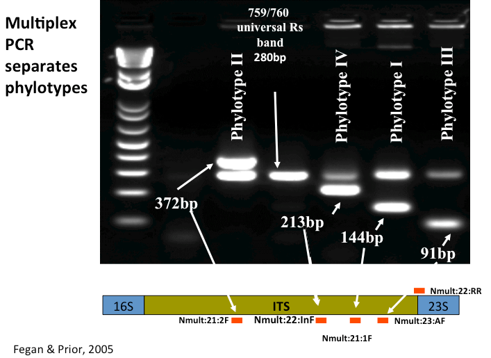

## PCRs to detect & classify plant pathogenic *Ralstonia*
**Writing/editing credit**: Caitilyn Allen lab, Tiffany Lowe-Power

## 1. Universal plant pathogenic *Ralstonia* PCR (759/760)

Detects a region present in most *R. solanacearum, R. pseudosolanacearum, R. syzygii* strains (82/85 tested by Opina)

**Citation**: Opina et al. 1997. A Novel Method For Development Of Species And Strain-Specific DNA Probes And PCR Primers For Identifying Burkholderia solanacearum (Formerly Pseudomonas solanacearum). Asia Pacific Journal of Molecular Biology and Biotechnology Volume 5, No. I, April, 1997 pp. l9-30.)

|Primer Name |  Sequence (5' to 3')             | 
|:-----------:|:---------------------------------|
|    759      | GTC GCC GTC AAC TCA CTT TCC      |
|    760      | GTC GCC GTC AGC AAT GCG GAA TCG  | 
**Product Size**: 281 bp

#### PCR conditions

* Controls: 
    1. No template control
    2. Positive control (e.g. gDNA from GMI1000)
* Calculate OneTaq or similar mastermix with [pcr_workbook](workbooks/pcr_workbook.xlsx)
* Thermal cycler conditions: Run OneTaq program with **58C anneal** & **30 s extension** time
* Resolve on **2%** agarose gel

## 2. Phylotype PCR (Multiplex)

**Citation**: Fegan, M, and P. Prior 2005. How complex is the R. solanacearum species complex? In: Bacterial Wilt: The Disease and the Ralstonia solanacearum species complex (C. Allen, P. Prior, and A.C. Hayward, editors). APS Press, St Paul.

|Common Primers (CP) Name| Primer Name |  Sequence (5' to 3')    | Phylo specificity | Band size (bp)* |
|:-----------------------|:-----------:|:------------------------|:-----------------:|:----------------| 
|CP1                     | Nmult21:1F  | CGTTGATGAGGCGCGCAATTT   | I                 | 144             |
|CP2                     | Nmult21:2F  | AAGTTATGGACGGTGGAAGTC   | II                | 372             |
|CP3                     | ßNmult23:AF | ATTACSAGAGCAATCGAAAGATT | III               | 91              |
|CP4                     | Nmult22:InF | ATTGCCAAGACGAGAGAAGTA   | IV                | 213             |
|CP5                     | Nmult22:RR  | TCGCTTGACCCTATAACGAGTA  | all               | N/A             |

#### PCR conditions

* Controls: 
    1. No template control
    2. Positive control (ideally 1 strain from each phylotype, but at a minimum do a gDNA from a known isolate)
* ***XXX Someone needs to add this to pcr_workbook*** Reactions were carried out in a total volume of 20 µl containing 1 x PCR buffer (supplied by the manufacturer of the polymerase) 1.5 mM MgCl2, 0.2 mM of each dNTP, 2U of Taq Polymerase 6 pmoles of the primers Nmult:21:1F, Nmult:21:2F, Nmult:22:InF, 18 pmoles of the primer Nmult:23:AF and 4 pmoles of the primers 759 and 760 (1). Reactions were heated to 96oC for 5 min and then cycled through 30 cycles of 94oC for 15s, 59oC for 30s and 72oC for 30s, followed by a final extension period of 10 min at 72oC. 

* Thermal cycler conditions: Run OneTaq program with **59C anneal** & **30 s** extension time
* Resolve on **2%** agarose gel

Expected results:

## 3. Detection of Race 3 Biovar 2 strains
**If reaction is positive, notify Tiffany Lowe-Power immediately.** We are not permitted to receive, use, or store R3B2 organisms. If there is a positive reaction with the R3B2-specific primers, secure any materials with the R3B2 positive organism in a locked cabinet or freezer until they have been deactivated by autoclave. Tiffany will notify Aphis about the receipt of R3B2 organisms. 

**Citation**: Opina et al. 1997. A Novel Method For Development Of Species And Strain-Specific DNA Probes And PCR Primers For Identifying Burkholderia solanacearum (Formerly Pseudomonas solanacearum). Asia Pacific Journal of Molecular Biology and Biotechnology Volume 5, No. I, April, 1997 pp. l9-30.)

|Primer Name |  Sequence (5' to 3')             | 
|:-----------:|:---------------------------------|
|    630      | ATA CAG AAT TCG ACC GGC ACG      |
|    631      | ATT CAC ATG CAA TTC GCC TAC      | 
**Product Size**: 307 bp

#### PCR conditions

* Controls: 
    1. No template control
    2. Positive control (We do not have access to live Race 3 strains, but Caitilyn Allen's lab generously purified DNA from UW551 for us)
* Calculate OneTaq or similar mastermix with [pcr_workbook](workbooks/pcr_workbook.xlsx)
* Thermal cycler conditions: Run OneTaq program with **60C anneal** & **30 s** extension time
* Resolve on **2%** agarose gel
* **If reaction is positive, notify Tiffany Lowe-Power immediately.**

## 4. Multiplex PCR to Identify Ralstonia Species and Phylotype IIB1

Citation: “RSSC-Lineage Multiplex PCR” assay detects and differentiates Ralstonia solanacearum, R. pseudosolanacearum, R. syzygii and the R3bv2 subgroup, Sujan Paudel, 2022, https://doi.org/10.21203/rs.3.rs-1693987/v1

|Common Primers (CP) Name|Primer Name|Sequence (5' to 3')|Species Specificity|Band size (bp)*|
|:-----------------------|:----------|:------------------|:------------------|:--------------|
|CP6|RssC-wF3|TATATATCCTCGACTTTTCCATGAAGCTGTG|Ralstonia solanacearum species complex (F)|162|
|CP7|RssCwR3|CTATATATATACCCCACTTGTTGAGGAACTG|Ralstonia solanacearum species complex (R)|162|
|CP8|Rpseu-wF5|TTTTATTTTTTTGGTGTCCGGGCCAAGATAG|R. pseudosolanacearum (Phylotype I and III) (F)|251|
|CP9|Rpseu-wR5|TTATATTACTCGAACGTGCTGCAAAACCACT|R. pseudosolanacearum (Phylotype I and III) (R)|251|
|CP10|RsolP2wF2|ATTCTATTTATATCATGAGCGTTCCCCGACT|R. solanacearum (Phylotype II) (F)|478|
|CP11|RsolP2wR2|TTTTTTTTTTTGAGGTAGCTGCTGGGGTTC|R. solanacearum (Phylotype II) (R)|478|
|CP12|RsyzP4wF4|TTTCTTTTATTATAGTGTCGCGTCCGAACAG|R. syzygii (Phylotype IV) (F)|664|
|CP13|RsyzP4wR4|TTTTTCTTTTTCGGTCTCTCCGTCTATCGTT|R. syzygii (Phylotype IV) (R)|664|
|CP14|RsR3B2wF|TTTCATTACTCATGACTGCAGAAACGCTTGA|Race 3 biovar 2 (II-R3bv2)(F)|954|
|CP15|RsR3B2wR|TATACATAACTATAGTTCGCCGTGCTCATCT|Race 3 biovar 2 (II-R3bv2) (R)|954|

## 5. Determine Sequevar of an Isolate
*This can be updated with more specific details*

The sequevar system is a DNA based taxonomic system of plant pathogenic *Ralstonia*. The system is based on DNA sequence alignments of a 750 bp region of the *egl* endoglucanase gene. 

### Step 1: Purify genomic DNA from the isolate

* Streak out the isolate on CPG+TZC and obtain single colonies. 
* Inoculate a single colony into CPG broth and incubate overnight.
* Extract DNA from 1 ml of a dense culture using the DNeasy Blood & Tissue kit. 

### Step 2: Amplify a 750 bp region of the *egl* gene

|Primer Name |  Sequence (5' to 3')             | 
|:-----------:|:---------------------------------|
|    Endo-F      | ATGCATGCCGCTGGTCGCCGC      |
|    Endo-R      | GCGTTGCCCGGCACGAACACC      | 

Follow instructions for a High Fidelity PCR reaction (E.g. Kapa HiFi) to amplify the band.  You will add 50 ng of purified genomic DNA as template. Run a program that is appropriate for a 750 bp target. Use an anneal temperature of 60 C (it looks like anything from 55-64C has been used in the literature). 

### Step 3: Visualize on an agarose gel to confirm a successful amplification
See the [DNA electrophoresis protocol](dna_electrophoresis.md) for more details.

* Make a 0.8% w/v agarose gel in 1x LAB buffer with ethidium bromide. 
* Load 2 ul of your PCR reaction (mix with loading buffer). Don't forget to run DNA ladder in a well. 
* Run the gel
* Visualize the gel on a UV box. Save a photograph. 
* Analyze the gel -- annotate a few size markers on the ladder.  You should have 1 strong, single band at 750 bp in your PCR wells. 

#### Troubleshoot the PCR if necessary, otherwise proceed to step 4

### Step 4: Purify the PCR reaction

Use the Zymo DNA clean & concentrator kit to purify your PCR products (1 prep per reaction). 

Check DNA purity on the nanodrop.  Record the estimated DNA concentration and 260/280 and 260/230 ratios.  Also save a photograph of the full spectra of you DNA.  Discuss with someone whether it looks "pure" or whether there are contaminant peaks. 

### Step 5: Submit the sample for Sanger Sequencing

Follow the [Sanger Sequencing protocol](sanger.md).  Sequence the reactions with both the Endo-F and Endo-R primers (separate reactions)

### Step 6: Interpret the sequence.  

Import the sequencing trace (.ab1 file) into Benchling in the "1-egl (partial) sequences".  Align the F and R and proofread the sequences. 

After this point ... Tiffany has a word protocol from Caitilyn's lab that we can adapt to assign a sequevar based on the sequence. 
