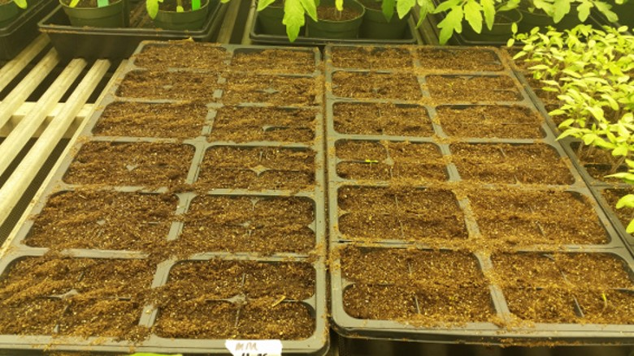
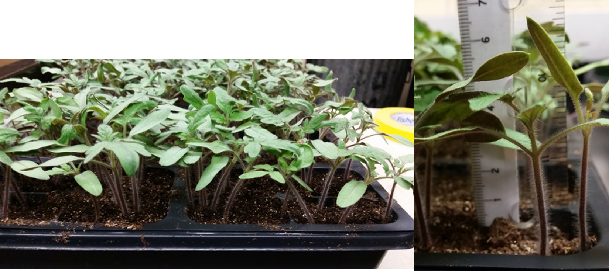
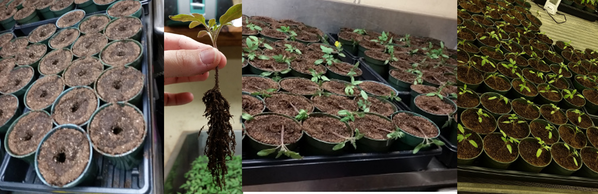

## Growing Tomato plants

**Writing/Editing by**: Tiffany Lowe-Power, Patrizia Ricca,

### Sowing Seed 
Sow seed 17 day before soil-soak inoculations and 21 day before cut-petiole inoculations. 
1. Add potting soil ***XXXtype to be determined*** to a plastic seedling insert in a tray.
    * Break up large clumps of soil.
1. Wet the soil & gently compress it. 
1. Sow tomato seed at 3-5 seeds per insert well. 
    * Space the seeds out. Otherwise the roots will be tangled and difficult to separate. 
1. Cover the seeds with additional soil and wet soil. 
1. Label the tray with your name, sowing date, and tomato genotype.
1. Place the tray in the XXX growth chamber (28 C) and water regularly. 

#### Expectations for plant growth:
* Expect seeds to germinate and emerge from soil at XXX days
* After emergence, the first true-leaf should appear by XXX days. 
* Germination frequency should be >80 %. 

### Transplanting
2 weeks post-sowing, transplant the seedlings to individual XXX inch pots. 
Plants should be at 2 leaf/petiole stage.
If you are inexperienced with petiole inoculations, transplant extra plants in case you maul one. 

1. Prepare XXX-inch pots with potting soil. 
Fill pots with loose soil. 
Wet the soil. 
With your index finger, make a hole in the center of the pot. 
1. Separate the seedlings:
    * See the video on [Youtube](https://youtu.be/OHwhlRWz0SI) *(download at: images/plants/transplant_tomato.m4v)*
    1. Tip: The soil should be moist, but not wet. If the soil is wet, it will aggregate and the weight will cause excessive root tearing. If the soil is dry to cracking, it will cause similar, but less severe root damage.
    1. Choose plants of equal size to transplant. 
    1. Remove each insert well in a way that minimizes root tearing: Gently push from the bottom while pulling the cluster of stems upwards. 
    1. To detangle the roots, you will need to loosen the soil. Alternatingly roll the root ball between the palms of your hands and gently shake/pat them until it's possible to tug the seedlings apart with minimal root tearing. 
1. Pot 1 seedling per pot. 
    1. Place each seedling into the soil so that the roots are buried, but that the stem is above the soil-line.
    1. Compact the soil toward the seedling to stabilize the seedling (*Use both hands to compress the soil from 4 directions around the stem of the plant*). Then compact the rest of the soil downwards.

#### Avoid weird plants
* Plants with 2 true leaves and a lack of a meristem
* Plants with mottled leaf color

#### Expectations for plant growth:
* By 3 weeks post-sowing, the plants should be at the 3-4 leaf stage. 