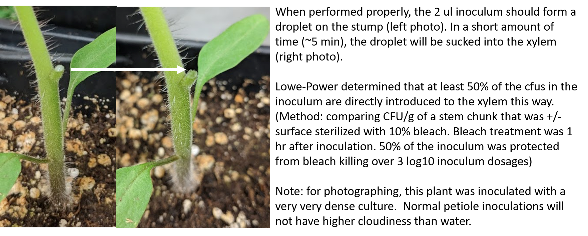

# Tomato Petiole Inoculation

**Writing/Editing credits:** Tiffany Lowe-Power, 

### 1. Prepare Plants

Sow seed 3 weeks before inoculation date. 

Follow directions in [Growing Tomato Plants Protocol](tomato_growth.md)

### 2. Prepare bacterial inocula

1. **Day 0** - Three days prior to plant inoculation, plate the relevant bacterial strains on CPG agar.
    * If plates are kept moist (generous agar layer without cracking), you can plate out the bacteria up to 6 days before inoculation. 
1. Incubate bacteria at 28°C for 2 days.
1. **Day 2** - Inoculate 3 ml CPG broth in a glass culture tube with one colony of each *Ralstonia* strain for infection. 
Prepare duplicate tubes as backup.
1. **Day 3** - Pellet 1 ml of culture (>10k *xg* for 1 min) and resuspend in dI H2O. Measure and record the OD600 of a 1:10 dilution. 
1. Plants will be inoculated with 2 ul bacterial suspension for a target inoculum of ~1000 CFU, so prepare a suspension at 
5x105 CFU / ml. 
Using a conversion of OD = 0.2 equals 1x108 CFU / ml, adjust the bacterial concentration to 5x105 CFU / ml. 
The ['bacterial_density_workbook.xlsx'](bacterial_density_workbook.xlsx) may help you. 
    * *Note*: You may need to validate the OD to CFU/ml conversion when working with new wildtype backgrounds or EPS- mutants. 
    * Depending on research question, you might change the target inoculum density.

### 3. Dilution plate to confirm the inocula

1. Label CPG plates to plate samples of the inoculum. 
1. For inocula of 1x103 CFU / plant, inoculum is 5x102 CFU / ul. Serially dilute to 10-3 and plate 3 technical replicates of 10 ul droplets of the 10-3, 10-2, and 10-1. 
1. Incubate at 28C for 2 days or on the benchtop for 3 days before counting colonies. 
Use the ['bacterial_density_workbook.xlsx'](bacterial_density_workbook.xlsx) to calculate and verify inoculum density    

### 4. Cut-petiole inoculate the plants
Note: Empirically, inoculations are more uniform if the soil is dry and plants are watered after inoculation.

* ***Importantly***, the petiole must be dry or else capillary action will draw the inoculum droplet down the outside of the plant before it can enter the xylem.

1. Label the plants, either with plastic stakes in the soil or with lab tape on the tray: Initials, date, & experimental variables.

1. Per plant, locate the oldest (lowest) true leaf. 
This petiole will be the inoculation site. 
In batches of 5, use a sharp razor blade to remove the petiole leaving a horizontal pedestal wound such that ~2 mm of the petiole remains. 
    * *Note*: Take care to only cut the petiole and to not damage the main stem. 
    *It's best to **keep the blade steady** next to the target cut site and to **pull the petiole into the blade***. 
    This ensures that when the cut is complete, the plant pivots away from the blade. 
    If you move the blade towards the petiole, you are likely to cut into the stem after cutting the petiole.
1. With a P2, add a 2 ul droplet of bacterial suspension to the wound-pedestals. 
    * *Note*: [Reverse pipetting](https://en.wikipedia.org/wiki/Reverse_pipetting) is recommended for increased accuracy when pipetting small volumes. 
    * The droplet should sit on the pedestal. 
    If it immediately disappears/is drawn down the side of the stem, dry the pedestal and sides of the stump with a kimwipe and repeat the inoculation. 
    For sensitive assays, discard plants (biohazard trash) where inoculation needs to be repeated.
    * Within 5 min, the droplet should be sucked into the xylem. 
    Avoid disturbing the plants before the droplet enters the xylem. 
    With care, you should be able to gently move plants without disturbing the droplet.

