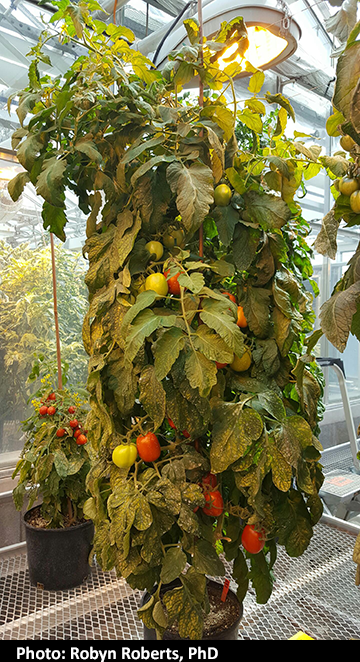

# Protocol: Bulking tomato seed

**Written/Edited by**: Tiffany Lowe-Power, 

Protocol modified from [Tomato Genetics Resource Center TGRC](https://tgrc.ucdavis.edu/seed_germ.aspx) based on advice from Dr. Robyn Roberts (Greg Martin; Boyce Thompson Institute)

## Bleach seed
*Necessary for seed sources outside our lab that could come in with TMV, Clavibacter, or another seed-coat pathogen*

1. Incubate 5-10 tomato seeds in 50% commercial bleach (2.7% sodium hypochlorite) for 90 min. 
    * *Note: this will degrade the seed coat (removing pathogens), but leave very fragile endosperms. Avoid squishing with your fingers*
1. Rinse the seeds well by pouring them through a fine mesh strainer (e.g. tea ball) and rinsing in a gentle stream of tap water. 
1. Return fragile seeds to 1 ml water in 1.5 ml tube and sow ~immediately. 

## Sowing
1. Pre-wet potting soil in labeled pots or labeled seedling trays. 
1. Make a ~1 cm indentation with your finger or a sharpie. 
1. *Use a metal 'chemical' spatula* to gently transfer a coat-less seed from the water suspension to the hole. 
1. Cover with wet soil. 
1. Allow to germinate in growth chamber. 

## Seed production
1. After ~2 weeks, transplant 2-to-3 seedlings to ~4" pots  and grow until 4-5 weeks old. 
1. Transplant to large pots for seed production. At this point, prune plants so that there is a single main stem: Remove lateral meristems that will lead to bushy, out-of-control growth. 
1. Put a tomato cage around the  or a central stake.  Secure plant to stakes with paper-wrapped twist ties. Continue to train it along the support
1. Once per week: pollinate & prune
    * *Pollinate*: (works best in morning) shake the plant or tap the flowers.  If you pollinate multiple accessions, use a glove if touching flowers & switch gloves between plants. 
    * *Prune*: Continue to remove lateral meristems. 

## Seed Harvesting
1. Choose ripe tomatoes (e.g. very red). Harvest into a bucket labeled with cultivar/accession & return to lab. 
1. Prepare work area: Line bench with paper towels / diaper, a beaker labeled with the accession, and a fresh razor blade. Optional PPE: lab-coat and goggles. 
1. Use a blade to slice open tomatoes. Push out the goop+seeds into the beaker with your thumb. The seeds are coated in polysaccharides that must be fermented off. 
1. Add tap water to the seed goop and allow to ferment 1-3 days until a thin fuzzy mold grows on top. 
1. Clean the seeds: Use a mesh strainer to scoop off the floating seeds (these tend to have low viability).  Then dump the seeds into the strainer and rinse generously in tap water.  Remove fruit chunks. 
1. Lay the seeds out in a ~single layer on a paper towel to dry for 1-2 days.  
1. Move seeds into seed pouch or plastic tube labeled with: Accession and date.  

Seed Production plants should look similar to this:

</img>

