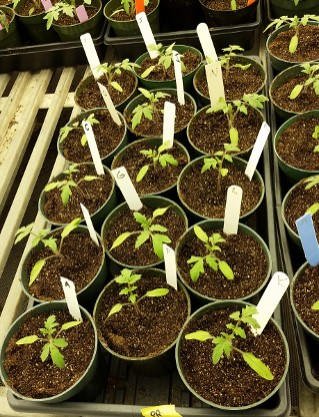

# Tomato Soil Soak Inoculation

**Writing/Editing credits:** Tiffany Lowe-Power, Patrizia Ricca

### 1. Prepare Plants

Sow seed 17 d before inoculation date. 

Follow directions in [Growing Tomato Plants Protocol](tomato_growth.md)

**Soil moisture level is very important for successful inoculation.** 
It must be fairly dry to absorb 50 ml bacterial suspension, so do not water plants for 1-2 days pre-inoculation.
Post inoculation, moderately water plants frequently (at least daily) to keep soil moist, but not so wet that water runs out of pots. Dry soil will crash *R. solanacearum* populations. 
Avoid dry soil for 4-5 days post inoculation. 
The sunshine mix (based on peat moss) is more likely to retain inoculum in the soil. 

### 2. Prepare bacterial inocula

1. **Day 0** - Three days prior to plant inoculation, plate the relevant bacterial strains on CPG agar+antibiotics.
    * If plates are kept moist (generous agar layer without cracking), you can plate out the bacteria up to 6 days before inoculation, but less time is better. 
1. Incubate bacteria at 28°C for 2 days.
1. **Day 2** - Inoculate 50 ml CPG broth in 125 ml flask with several colonies of each *Ralstonia* strain for infection. To do that scoop up several colonies to accumulate an inoculum roughly the size of the end of a q-tip. Prepare duplicate flasks as backup.
    * Assume culture will reach OD = 2.0, and scale up volume depending on # of plants that you will inoculate with 50 ml of OD = 0.1 bacterial suspension. 
    Make sure to scale up # of flasks or size of flasks with increased CPG broth.
    * Add antibiotics if strain carries a replicative plasmid. Chromosomal integrations should be stable. 
1. **Day 3** - Pellet culture in 50 ml tubes (8k *xg* for 5 min in fixed angle rotor or 5k *xg* in swinging bucket) and resuspend pellet in 25 ml dI H2O. If you have multiple pellets/strain, pool them.
Measure and record the OD600 of a 1:10 or 1:100 dilution. 
1. Plants will be inoculated with 50 ml of OD=0.1 bacterial suspension. 
The ['bacterial_density_workbook.xlsx'](https://github.com/lowepowerlab/protocols/tree/master/workbooks) may help you adjust cell density to inoculum. 
    * *Note*: You may need to validate the OD to CFU/ml conversion when working with new wildtype backgrounds or EPS- mutants. 
    * Depending on research question, you might change the target inoculum density.
    * Sterile water is unnecessary. 
    Use dI H2O. 

### 3. Dilution plate to confirm the inocula

1. Label CPG plates to plate samples of the inoculum. 
1. For inocula of OD=.1, inoculum is 5x107 to 1x108 CFU / ml, depending on strain. Serially dilute to 10-6 and plate 3 technical replicates of 10 ul droplets of the 10-6, 10-5, and 10-4. 
1. Incubate at 28C for 2 days or on the benchtop for 3 days before counting colonies. 
Use the ['bacterial_density_workbook.xlsx'](https://github.com/lowepowerlab/protocols/tree/master/workbooks) to calculate and verify inoculum density    
### 4. Soil-Soak inoculate the plants

**Soil moisture level is very important for successful inoculation.**
It must be fairly dry to absorb 50 ml bacterial suspension, so do not water plants for 1-3 days pre-inoculation. Pouring slowly the 50 ml bacterial suspension around the plant stem and not in one spot could improve bacterial suspension retention and avoid any drip outside the pot. 
Post inoculation, moderately water plants frequently (at least daily) to keep soil moist, but not so wet that water runs out of pots. 
Dry soil will crash *R. solanacearum* populations. 
Avoid dry soil for 4-5 days post inoculation. 

How plants should look at time of inoculation:

1. Label the plants, either with plastic stakes in the soil or with lab tape on the tray: Initials, date, & experimental variables.
    * If labeling with stakes, try to avoid damaging roots (go along pot edge). 
    Preferably label with stakes 1-2 days before inoculation.
1. With 50 ml conical tube, uniformly and slowly pour 50 ml bacterial suspension into the soil of each plant near the stem. 
    * Avoid pouring on leaves.
1. If soil was cracked-dry before inoculation, return at the end of the day to add more water to soil to keep it from drying out.
Otherwise water first thing the next day. 
