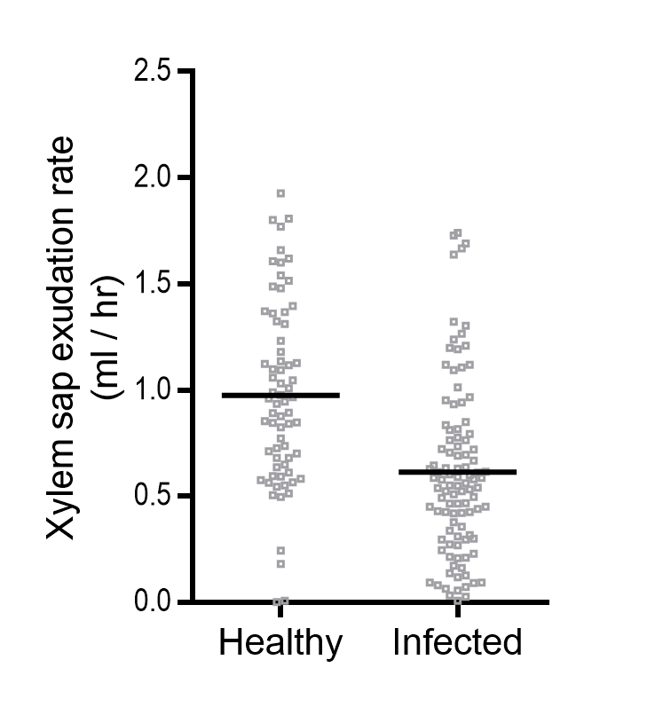

# Harvesting Tomato Xylem Sap by Root Pressure

**Writing/Editing Credits**: Tiffany Lowe-Power,

*This protocol assumes you have tomato plants (>3 weeks old) that have been grown in potting soil*

## Important physiology knowledge for sap harvesting

* Root pressure builds up *overnight* if plants are well-watered, but not water-logged.
Water-logged soil will make roots hypoxic. 
Root pressue will descrease throughout the light period.
    * *Practical advice*: Plan to harvest xylem sap in the morning (within 4 h of light onset). 
    Before leaving work the day before harvesting, water plants well 
    (i.e. so that soil is thoroughly soaked, but that run-off does not significanly pool in the tray)

* Physical pressure on the stem can influence metabolite composition of sap. 
    * *Practical advice*: Avoid squeezing the stem. Use a sharp blade (less pressure than a dull blade). 
    When making the first cut, stabilize the plant by holding 'top parts' of plant with non-dominant hand. 

* Sap follows the rules of capillary action.
    * *Practical Advice*: Make a flat, non-jagged stump for sap to pool. If stump appears damp, but a sap-bubble does not form, the sap is discretely flowing down the stem. 
    Gently rinsing the stump & gently blotting dry the stump surface and side of the stem will discourage.
    Making sure sides of stem are dry *first* will deter capillary action sucking the sap down the sides. 

* Freeze / thaw can lyse bacteria. 
    * *Practical Advice*: Remove bacteria from sap before freezing.
    Centrifugining at a minimum; 
    centrifuging + filtering with 0.22 um for sensitive experiments. 
    Harvest sap into tubes on wet ice, not on -20 freezer blocks or on dry ice. 

* Sap flow rate is variable between plants and that has consequences. 
Slower flowing sap is generally more concentrated with solutes than fast-flowing sap. 
    * *Practical Advice*: When pooling, pool equal volumes between individual plants (unless it does not affect your experiment/hypothesis if the fast-flowing plants' sap dilutes signal in the slower plants). 
    * Width of stem is positively correlated with sap flow volume (wider stems = more vessels)
    * *Ralstonia* infection decreases sap flow vol. 
    * Distribution of accumulated sap vol in ~4 week old Bonny Best tomato; healthy vs. wilt symptomatic for < 16 h [(data source)](https://onlinelibrary.wiley.com/doi/abs/10.1111/1462-2920.14020):
    
    

* Sap composition reportedly does not change noticeably over time. 
    * *Practical Advice*: Although previous iterations of xylem sap sampling protocols/methods limited the sampling window to 3 hr, this appeared to be overly cautious. 

## Protocol

1. Arrange collection tubes on wet ice. 
    * For precise assays, 1x 1.5 ml microtube per plant -- 
    *preferably spatially arranged to match plant arrangement. less mistakes*
    * For course assays, collect sap from all plants from a condition into 15 ml or 50 ml conical. 

1. Detop each plant with a smooth, horizontal cut using a sharp razor blade.
    * **Cut site:** Cut at the `cotyledon juncture` for healthy / soil drench inoculated plants.
    Cut at the `petiole wound` for petiole-inoculated / mock inoculatd plants. 
    * If you accidentally cut at an angle, make a fresh horizontal cut. 
    * Switch to a new razor blade after 5 plants, but sterilize it for reuse for less sensitive protocols. 
    Generally, it works well to stagger plants in batches of 5. 
    * You may want to keep (and label) the aerial portion of the plant for subsequent dilution plating.

1. Allow initial sap to pool on the stump for ~3 min. 
Blot away first-sap with kimwipe and rinse sap with dI H2O with a P200 pipette.
Blot dry again.
*This washes plant-cell cytosolic contamination from the stump*  

1. Collect sap for a uniform amount of time (e.g 30 min up to 2 h).
    * *Just in case there turn out to be differences in sap composition... don't let that variation confound your data. Record the sampling time in your experimental notes*  

## Misc. notes

* If you want to measure sap volume per plant, pre-weigh collection tubes and weigh tube after collection. 
Sap has similar density to water, so `1 mg = 1 ml`.

* If filter sterilizing sap, consider the 4 mm diameter filters with 0.22 um pores (e.g. Corning #431212).
Less volume will be lost, but also easier to clog! 
Pellet cells/debris first!

